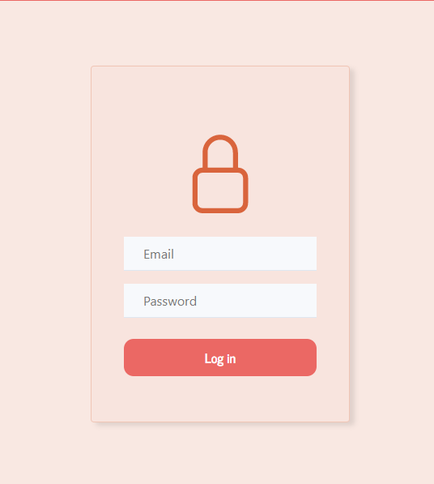

# DESCRIPTION
**Innoscripta**'s test work. This is front part of project. Back is located in [Other repository](https://github.com/tupseny/innoscripta-pizza-backend)

## PAGES
### Home

### Menu

- Overview all meals in categories
- Can add any meal by clicking the button `+` or update amount input

### Cart

- Overview all meals added to cart
- Can remove meal from cart by clicking the trash 
- Ability to make the order by clicking `Procceed to checkout` button

### Order making

- Complete the order by filling `address` and `phone number` fields

### Order history

- Overview all orders made by user (authorisation _!required_) (includes no anonymous orders)

### Login

- Authorise user by filling `email` and `password` fields

### Register

- Authorise new user by filling `email` and `password` & `repeat` fields

### Currency changer

- Ability to change the main currency and convert all prices by exchange rate

## Available Scripts

### `npm start`

Runs the app in the development mode. 
Open [http://localhost:3000](http://localhost:3000) to view it in the browser.

The page will reload if you make edits. 
You will also see any lint errors in the console.

### `npm run build`

Builds the app for production to the `build` folder. 
